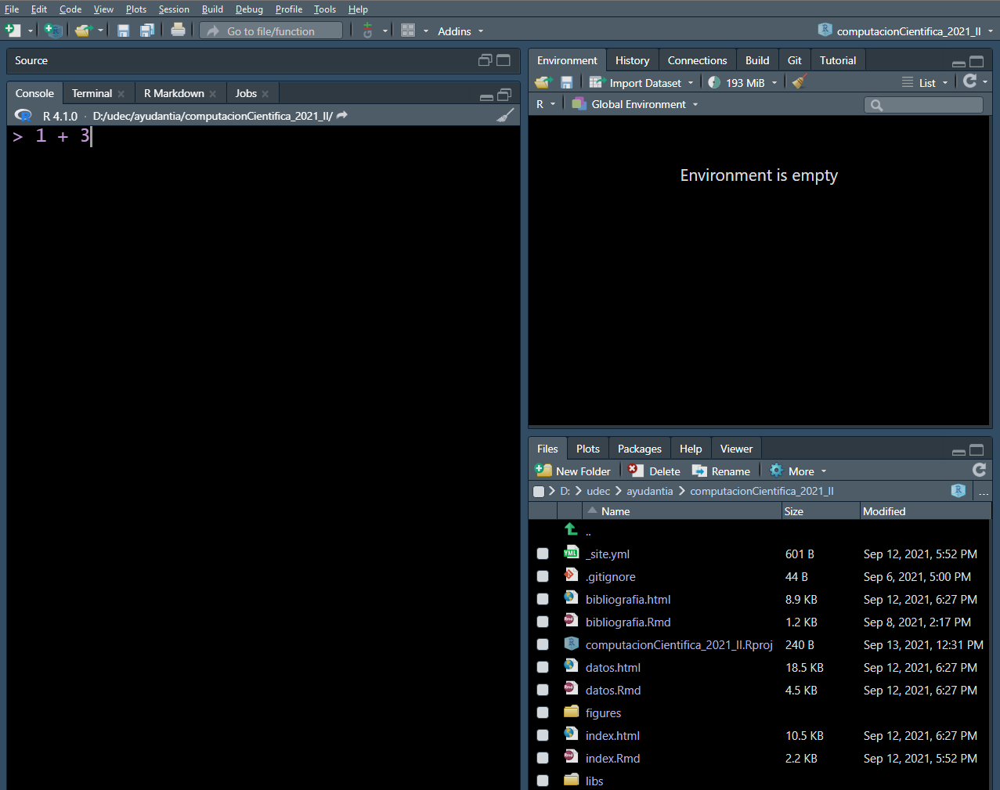

```{r setup, include=FALSE}
knitr::opts_chunk$set(echo = TRUE)
```

## Objetivo {.unnumbered .objectives}

- Instalación de R-studio

- Conceptos básicos de R-studio

## Conceptos generales: Software

### ¿Qué es R y Rstudio?

1. R es un lenguaje de programación científica.

2. R-studio es un entorno de desarrollo integrado (IDE) que proporciona un entorno de codificación robusto para escribir y ejecutar código R. Se recomienda revisar el Cheat Sheets de Rstudio a través del menú **Help -> Cheat Sheets -> Rstudio IDE Cheat Sheet** para comprender rápidamente los paneles y atajos de los comandos.


```{r out.width="80%", fig.align='center'}
knitr::include_graphics("figures/cheatSheet.PNG")
```

### ¿Porqué usar R?

1. ¡Es gratis y trabaja en multiples plataformas!

```{r out.width="80%", fig.align= 'center'}
knitr::include_graphics("figures/Rmultiplataforma.png")
```

2. Es un comando de programación.

3. Gráficos y Visualización.

```{r out.width="80%", fig.align="center"}
knitr::include_graphics("figures/Rgraficos.png")
```

4. Un solo software para diferentes tipos de análisis. Miles de análisis estadísticos clásicos y modernos estan disponibles en R o en paquetes para R.

5. Automatización de metodologías. Con R, la realización de un procedimiento y/o ordenamiento de la data mediante un script no necesita crearse cada vez que se inicia el programa. **¡Es automático!**

6. Acceso a técnicas recientemente desarrolladas o en desarrollo permamente por la comunidad científica mundial. 

7. No hay límites. Si no se encuentra lo que se busca, uno mismo puede construirlo.

## Instalación de R-studio

Para el desarrollo del presente curso se necesitará instalar el software estadístico [R-project](https://cran.r-project.org/bin/windows/base/). También, es recomendable instalar un editor de texto. Por simplicidad, se recomienda utilizar [R-studio]( https://www.rstudio.com/products/rstudio/download/]).

```{r}
knitr::include_graphics("figures/ventanasRstudio.png")
```

1. **La consola**. Aquí se escriben los comandos de código y se obtiene directamente los resultados sobre lo que se realizó.

2. **Editor de código**. Permite escribir y reproducir los comandos realizados, siempre en cuando se guarde el archivo en formaro *.R*.

3. **Espacio de trabajo e historial**. El espacio de trabajo o *environment* muestra los objetos almacenados en la memoria de **R**. Por ejemplo, datos que importemos. El historial o **history** muestra los comandos que previamente se envió a R.

4. **Ficheros, visualizaciones, ayuda y paquetes**

    - *Files*, permite ver y explorar los archivos de nuestro computador.
    - *Plots*, muestra las figuras realizadas y permite exportarlas en diferentes formatos.
    - *Package*, permite gestionar (instalar, actualizar) las diferentes paqueterías desarrolladas en R.
    - *Help* da acceso a varias páginas de ayuda.
    - *Viewer* puede ser usada para visualizar documentos en formato HTML realizados en R.

### Mi primer comando

Para iniciar: Abrir Rstudio, luego en la consola escribir ` 1 + 3` debería aparecer en el indicador `>`. Luego presione enter.

```{r out.width="80%", fig.align='center'}

```
Trata de realizar operaciones aritméticas simples (suma, resta, división, multiplicación).

```{r}
# suma
2 + 5

# resta
45 - 12

# multiplicación
2 * 10

# división
2 / 10

# potencia
3 ^ 2
```

### Almacenar y reusar resultados

Para asignar valores a un objeto se debe emplear los llamados *operadores de asignación* `<-` o `=`.

```{r}
library(kableExtra)
tibble::tibble(
  operador = c("<-", "="),
  `Operación` = c("Asigna un valor a una variable",
                "Asigna un valor a una variable")
) %>% 
  kbl(booktabs = T) %>% 
  kable_styling(bootstrap_options = "striped",
                full_width = F,
                position = "center")
```

Aunque se puede usar el símbolo `<-` o `=` se recomienda emplear el primero debido a que es más fácil de reconocerlo visualmente. Además, no genera problemas en procesos más complejos de programación.

Para correr un proceso señalar con el cursos del mouse la línea del script a ejecutar. Luego hacer click en el boton `Run` ubicado en la parte superior derecha del panel del script o usar la combinación de teclas `ctrl + enter`.

```{r}
# asignamos un nombre a la operación
a <- 2 + 5

# Obtenemos los resultados de la operación
a

# Podemos realizar operaciones
a * 5
```

**¿Que nombres emplear?**

Se pueden emplear letras, números o caracteres especiales como `.`; `_`. Algunos ejemplos son: `var_1`, `var.1`, `VAR1`, `myVar1`. Recordemos que R es muy sensible a las mayúsculas y minúsculas, `Mi_var` y `mi_var` son diferentes. Evitar espacios en los nombres de los objetos ya que será mas fácil de trabajar con ellos.

### Crear un script

Para crear un script ir a `file -> New file -> Rscript`. 

```{r out.width="80%", fig.align='center'}
knitr::include_graphics("figures/firstScript.png")
```

Repetir todas las operaciones realizadas anteriormente pero ahora escribiéndolas en el nuevo script. ¿Qué observa?

### Importante {.unnumbered .keypoints}

Cuando escribas instrucciones en el script de R, debemos asegurarnos que todas las instrucciones se encuentren allí y no tipear directamente en la consola. Si tipeamos unos comandos en el script y otros en la consola, pronto tendremos un desorden en los procedimientos y dificultades al momento de intentar reproducirlo generando una gran frustación.

### Comentando tu script

Tomar apuntes respecto a lo que hace cada línea de código es de vital importancia para uno mismo o para otra persona con la que compartas tu código.

En R podemos realizar comentarios empezando una línea con el caracter `#`. Todo lo que se escriba después del `#` será ignorado por R. Se recomienda tomar nota

```{r out.width="80%", fig.align='center'}
knitr::include_graphics("figures/firstComment.PNG")
```

### Guardar y mantener seguro tu script

Nuestro script contiene todo las instrucciones y detalles de un trabajo especifico por tanto será importante guardarlo y mantener seguro generando respaldos si es necesario. Para realizar este proceso ir a `file -> Save us .. ` o usa la combinación de teclas `ctrl + s`. Asigna al script un nombre fácil de ubicar pero que signifique algo para nosotros (idealmente un nombre conciso sobre lo que hace el script o los datos que contiene).

### Errores comunes

Probablemente experimentaras diferentes errores a lo largo de este proceso de aprendizaje. Algunos de los más comunes son los siguientes:

 - Objeto no encontrado. R no encontrará un objeto si no ha sido definido previamente. 

```{r fig.align='center'}

```

- Advertencias. El código se ejecutará pero se notificará un mensaje de advertencia lo que significa que el código puede que no esté haciendo lo que se pretende o que R ha reconocido algo que solicitaste como riesgoso. **Nunca ignores un mensaje de advertencia**
    
- El temido `+`. Otro error es un resultado en la consola que luce como:\
Esto significa que la sintaxis del código escrito no esta completo. El `+` en la consola es la forma de decir de R "estos esperando que el proceso se termine". Cuando vea el `+` presione la tecla `esc` y vuelva a ejecutar todo el comando escrito correctamente.

```{r fig.align='center', out.width="30%"}

knitr::include_graphics("figures/errorTemido.PNG")
```

    
